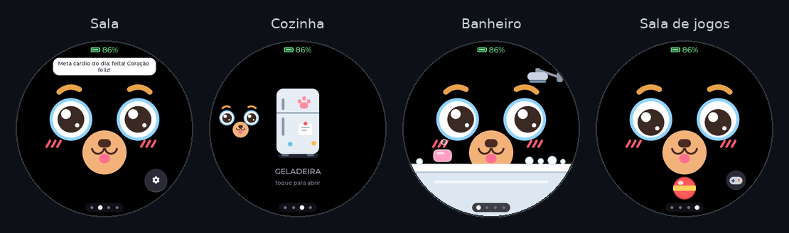
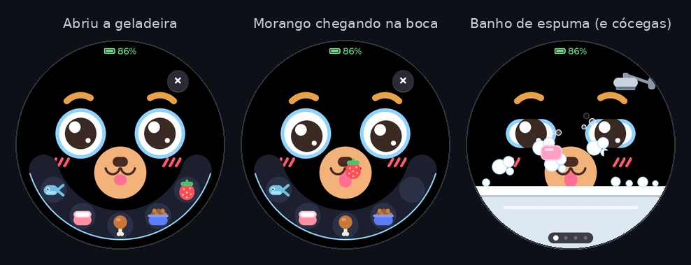
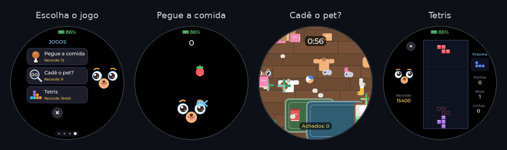
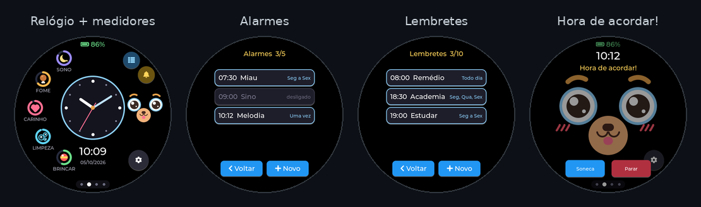
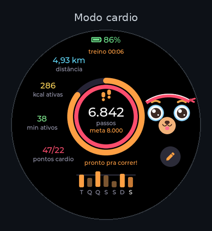
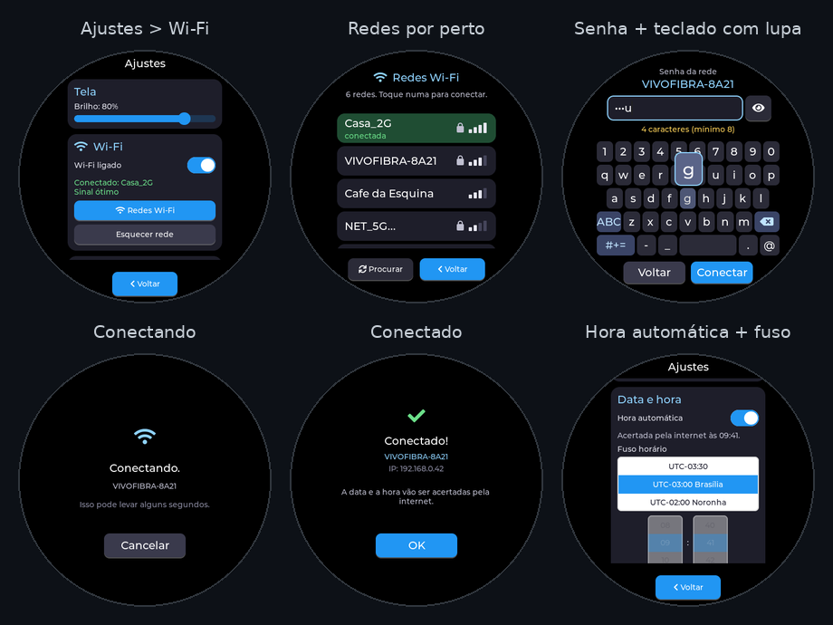
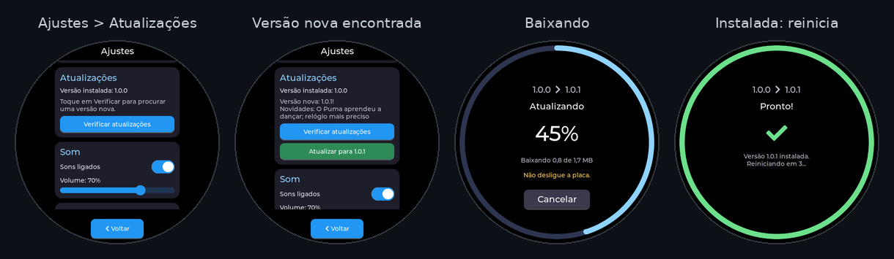

# pet_project

### Um bichinho de estimação que cabe na palma da mão.

Ele sente fome, sono e saudade, aprende a **sua voz**, joga com você, desperta você de manhã 
e fica mais esperto a cada atualização.

<table>
<tr>
<td align="center" width="33%"><h3>🐾 Vivo</h3>Sente fome, sono e saudade, muda de humor e pede a sua atenção.</td>
<td align="center" width="33%"><h3>🧠 Esperto</h3>Aprende a sua voz, lembra de você e entende comandos, sem internet.</td>
<td align="center" width="33%"><h3>📶 Conectado</h3>Relógio sempre certo e atualizações que trazem novidades.</td>
</tr>
</table>

---

## Conheça o seu novo pet

Ele mora numa tela **AMOLED redonda e sensível ao toque** e tem personalidade própria: pisca, olha
em volta, boceja quando está com sono, fica tonto se você gira o aparelho e fica tristinho quando
está com fome. Você cuida dele, dá comida, dá banho, brinca e faz carinho. Em troca, ele presta
atenção em você, aprende o seu jeito de falar e lembra do que você contou para ele.

E o melhor: **tudo acontece dentro do aparelho**. Ele entende a sua voz sem internet e sem enviar
nada para lugar nenhum. O Wi-Fi é opcional e serve só para deixar o relógio sempre certo e
receber versões novas.

---

## ☀️ Um dia com o seu pet

| Quando | O que acontece |
|---|---|
| **07:30** | O alarme toca com um *miau*, ele pula na tela e você escolhe entre soneca e parar. |
| **08:00** | "Hora do remédio!" Ele avisa: *"Não esquece o remédio, tá?"*, e você toca em **Feito!**. |
| **Almoço** | Ele está com fome: abra a geladeira e arraste o peixe até a boca dele. |
| **18:30** | "Hora da academia!" Ele dança: *"Vai lá ficar fortão!"*. Diga *"cardio"* e ele coloca a faixa para treinar junto. |
| **À noite** | Uma partida de Tetris, um banho de espuma, um carinho, e ele pega no sono. |

---

## 🎁 O que vem na versão 1.0

### 🐾 Um pet que sente de verdade
- **Cinco necessidades:** sono, fome, carinho, limpeza e brincadeira. Elas mudam com o tempo e aparecem no rosto dele.
- **Humores:** feliz quando recebe carinho, sonolento, tristinho com fome, sujinho, tonto, de barriga cheia (recusa comida balançando a cabeça) e com cócegas no banho.
- **Dorme sozinho** quando você para de mexer e acorda com um toque.
- **Desligou e ligou?** Ele está do jeito que você deixou. O tempo dele pausa enquanto o aparelho está desligado.

### 🏠 Uma casa com quatro cômodos
Deslize o dedo para passear: **Banheiro ← Sala → Cozinha → Sala de jogos**.

| Cômodo | O que tem |
|---|---|
| 🛋️ **Sala** | Onde ele vive e conversa com você num balãozinho. Deslize para baixo e aparece o **relógio** com os medidores das necessidades. |
| 🍽️ **Cozinha** | Uma geladeira com **peixe, leite, frango, ração e morango**. Arraste a comida até a boca dele e veja ele mastigar. |
| 🛁 **Banheiro** | **Sabonete** faz espuma (e cócegas!), **chuveiro** tira tudo. No fim ele comemora: "limpinho!". |
| 🎮 **Sala de jogos** | Uma **bola com física de verdade**: arremesse e ela quica nas bordas redondas da tela, enquanto ele acompanha com os olhos. |

### 🎮 Tres jogos

| Jogo | Como jogar |
|---|---|
| ⚽ **Bola** | Arraste e solte. Ela voa, quica e rola, e brincar enche a barra de diversão. |
| 🍎 **Pegue a comida** | **Incline o aparelho** para guiar o pet e pegar o que cai do céu. Cuidado com as bombas e as pedras! |
| 🔍 **Cadê o pet?** | Ele se esconde num quarto bagunçado maior que a tela: arraste para procurar. Ache o máximo de vezes em 60 s, e os reloginhos escondidos dão +10 s. |
| 🧱 **Tetris** | O clássico, com o pet torcendo do lado: comemora cada linha e fica preocupado quando a pilha sobe. |

Todos os **recordes ficam salvos**. E atenção: com a barriga vazia, ele não brinca. Primeiro a comida!

### 🎙️ Ele aprende a sua voz
- **Dê o nome que quiser.** Fale o nome dele algumas vezes e ele passa a atender quando você chama.
- **Entende comandos falados:** *comida, brincar, banho, dormir, carinho, alarme, lembrete, cardio* e *voltar*.
- **Entende números de 0 a 9** (para marcar horários falando) e **12 atividades**: estudar, trabalhar, correr, academia, remédio, água, reunião, caminhar, ler, cozinhar, médico e compras.
- **Melhora com o uso:** cada vez que acerta, ele guarda mais um exemplo da sua voz.
- **Privado:** o reconhecimento acontece **dentro do aparelho**. Nenhum áudio vai para a internet.

### 🧠 Um cérebro que lembra de você
- **Conversa num balãozinho** com uma "voz de pet": cada sílaba vira um bipe fofo, que muda com o humor.
- **Faz perguntas** e **lembra das respostas** para usar nas conversas.
- **Percebe a sua rotina:** sabe a que horas você costuma aparecer e nota quando você some.
- **Aprende os truques favoritos:** pulo, dança, língua de fora, olhar em volta e cantar. Faça carinho logo depois de um truque e ele entende que você gostou.
- **Comenta o seu dia:** comemora quando você bate a meta de passos e avisa dos lembretes que estão chegando.

### ⏰ Relógio, despertador e lembretes

- **Relógio analógico e digital:** deslize para baixo na sala. Em volta dele ficam os medidores de **sono, fome, carinho, limpeza e brincadeira**, e o pet vai para o lado olhar a hora com você.
- **Até 5 alarmes**, com dias da semana e quatro toques: *Bipe, Sino, Melodia* e *Miau*. Na hora, a tela acende, o pet pula e aparecem **Soneca** (+5 min) e **Parar**.
- **Até 10 lembretes** de atividades. Na hora, ele avisa do seu jeito (muitas vezes com um truque) e oferece **Adiar** (+10 min) ou **Feito!**, contando quantas vezes você cumpriu.
- **Tudo por voz:** chame o nome dele e diga *"alarme… sete, três, zero"* para despertar às 07:30, ou *"estudar… sete"* para um lembrete às 07:00.
- **Sininho e lista** em cima do relógio levam direto aos alarmes e aos lembretes.

### 🏃 Modo cardio

Deslize para cima (ou peça por voz) e ele **coloca a faixa de suor** para treinar com você.
- **Passos até a meta** no anel de fora e **pontos cardio** no anel de dentro, seguindo a recomendação da OMS.
- **Distância, calorias ativas e minutos ativos** do dia, ao lado.
- **Cronômetro do treino** e o seu **ritmo de agora**: parado, caminhando ou correndo.
- **Gráfico da semana:** os passos dos últimos 7 dias.
- **Metas, peso e altura ajustáveis** no botão de lápis.
- **Conta passos o dia todo**, mesmo com você longe da tela, e quando o treino termina ele fala como foi.

### 📶 Conectado (opcional)
- **Wi-Fi com teclado na própria tela.** Ele mostra as redes por perto e, ao tocar numa, aparece um teclado feito para a tela redonda. A letra embaixo do dedo aparece ampliada numa lupa, para não errar.
- **Relógio sempre certo:** com a **hora automática** ligada, ele acerta data e hora pela internet, com o fuso horário escolhido.
- **Se atualiza sozinho:** veja [como atualizar](#-como-atualizar-o-seu-pet).

### 🔋 Pensado para a bateria
- **Tela AMOLED:** preto é pixel apagado, então o fundo escuro economiza energia.
- **Desligar inteligente:** segure o botão e ele se despede, guarda tudo e dorme. O **relógio continua contando** e se recalibra sozinho enquanto o aparelho está desligado.
- **Indicador de bateria** e de carregamento sempre à vista.

---

## ✨ Detalhes que fazem a diferença

- 🌀 **Gire o aparelho** e veja os olhinhos virarem espiral.
- 🙅 **De barriga cheia**, ele recusa a comida balançando a cabeça.
- 😛 **Comida chegando:** ele abre a boca e põe a língua para fora.
- 🪰 **Sujo demais?** Aparecem moscas voando em volta dele.
- 👀 **Ele olha para as coisas:** acompanha a bola com os olhos, olha para o relógio e para a geladeira, e depois volta a olhar para você.
- 🏡 **Volta para a sala sozinho** se você deixar ele parado em outro cômodo.
- 💬 **Ele avisa** quando um lembrete está chegando: "Às 19:00 é hora de estudar!".
- 🎉 **Quando recebe uma versão nova**, ele comemora: *"Oba! Fiquei mais esperto!"*.
- 🔒 **Nada sai do aparelho** além de perguntar a hora e procurar atualizações.

---

## 👆 Como usar

| Gesto | O que acontece |
|---|---|
| **Tocar no pet** | Carinho (e acorda, se estiver dormindo) |
| **Deslizar para os lados** | Muda de cômodo |
| **Deslizar para baixo** (na sala) | Relógio + medidores das necessidades |
| **Deslizar para cima** (na sala) | Modo cardio |
| **Inclinar o aparelho** | Controla o jogo *Pegue a comida* |
| **Girar o aparelho** | Ele fica tonto 😵 |
| **Botão de engrenagem** | Ajustes: tela, Wi-Fi, atualizações, som, voz, inclinação, microfone, data e hora |
| **Segurar o botão PWR** | Desliga (o relógio continua contando) |
| **Apertar o botão PWR** | Liga, já com a hora certa |

> **Primeiros passos com a voz:** vá em *Ajustes > Voz e memória*, toque em *Ensinar o nome* e fale o nome
> escolhido algumas vezes. Depois, em *Ensinar palavras*, grave os comandos que quiser usar.

---

## 🔄 Como atualizar o seu pet

As versões novas chegam pela internet, sem cabo e sem computador.

1. **Conecte ao Wi-Fi:** *Ajustes > Wi-Fi > Redes Wi-Fi*, escolha a sua rede e digite a senha.
2. **Procure a versão nova:** *Ajustes > Atualizações > Verificar atualizações*.
3. **Atualize:** se tiver novidade, aparece o botão **"Atualizar para x.y.z"**, junto com o que mudou.
4. **Espere a reinicialização:** um anel em volta da tela mostra o progresso. No fim, o pet reinicia sozinho e comemora.

**Atualizar é seguro:**
- ✅ **Nada se perde:** nome, vozes ensinadas, alarmes, lembretes, passos, Wi-Fi e a memória do pet continuam lá.
- ✅ **Se a internet cair no meio**, nada muda: ele continua na versão que já tinha.
- ✅ **Se a versão nova der problema**, ele volta sozinho para a anterior.
- ✅ **Só oficial:** só aceita arquivos oficiais, com conexão segura (HTTPS) e conferência da "impressão digital" do arquivo.
- 🔋 **Bateria:** precisa de pelo menos 25 % (ou estar carregando).

---

## 📋 Especificações

| | |
|---|---|
| **Tela** | AMOLED redonda de 1,75", 466 × 466 pixels, sensível ao toque |
| **Processador** | ESP32-S3 dual-core de até 240 MHz |
| **Memória** | 16 MB de armazenamento + 8 MB de RAM extra (PSRAM) |
| **Sensores** | Movimento de 6 eixos (inclinação, giro e passos) |
| **Áudio** | Alto-falante e microfones |
| **Conectividade** | Wi-Fi 2,4 GHz (opcional) |
| **Energia** | Bateria recarregável com gerenciamento de carga |
| **Idioma** | Português |

---

## ❓ Perguntas frequentes

<b>Precisa de internet para funcionar?</b>

Não. O pet, os jogos, a voz, os alarmes e o cardio funcionam sem internet. O Wi-Fi só serve para a
hora automática e para receber atualizações.

<b>Funciona com Wi-Fi de 5 GHz?</b>

Não, só redes de **2,4 GHz**. A maioria dos roteadores tem as duas: escolha a de 2,4 GHz na lista.

<b>Ele entende qualquer pessoa?</b>

Ele aprende com a voz de quem ensinou. Por isso entende melhor você do que um estranho, e você pode
ensinar as palavras do jeito que fala, até em outro idioma.

<b>O alarme toca mesmo se eu não estiver olhando?</b>

Sim. Na hora marcada, a tela acende, o pet pula e o toque escolhido soa até você tocar em
*Soneca* ou *Parar*. Chamar o nome dele também para o alarme.

<b>Vou perder alguma coisa ao atualizar?</b>

Não. As atualizações trocam só o programa do pet. Tudo o que você ensinou e configurou fica guardado.

<b>E se a atualização falhar?</b>

Nada muda. Se a internet cair, a bateria acabar ou a versão nova não funcionar, ele continua (ou
volta) na versão anterior. Depois é só tentar de novo.

<b>O pet "envelhece" com o aparelho desligado?</b>

Não. O tempo dele pausa: quando você liga, ele está como você deixou. O relógio, esse sim, continua
contando a hora certa.

---

## 📜 Histórico de versões

| Versão | Novidades |
|---|---|
| **1.0.0** | Primeira versão: pet com 5 necessidades e humores, 4 cômodos, 4 jogos, voz que aprende, cérebro com memória, relógio, alarmes e lembretes por voz, modo cardio, Wi-Fi com teclado na tela, hora automática e atualizações pela internet. |

As próximas versões aparecem em **[Releases](../../releases)**, que é de onde o pet baixa as novidades.

---

## 📦 Sobre este repositório

Este é o **canal oficial de atualizações** do pet. Cada versão nova é publicada em
[Releases](../../releases) e os aparelhos baixam sozinhos. **Você não precisa baixar nada daqui**:
é só usar *Verificar atualizações* no próprio pet.

As pastas <code>.github/</code> e <code>tools/</code> preparam automaticamente os arquivos de cada versão.
As imagens desta página foram geradas a partir do software do aparelho.

---

© 2026 · Todos os direitos reservados.

